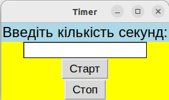
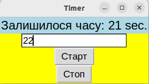
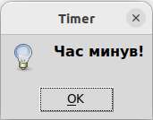

# Timer

Це скрипт на мові [Python](https://www.python.org/), який надає можливість використовувати простий таймер зворотного відліку за допомогою графічного інтерфейсу користувача. Завдяки використанню бібліотеки [tkinter](https://docs.python.org/uk/3/library/tkinter.html), користувач може ввести бажану кількість секунд для таймера і розпочати відлік.

Основні функції скрипта включають:

* Відображення графічного вікна з полем вводу для користувача, де він може вказати кількість секунд.

* Після натискання кнопки "Старт" таймер розпочинає зворотний відлік від заданого числа секунд до нуля.

* З кожною секундою, відображається залишок часу у вікні.

* Після досягнення нуля, з'являється спливаюче повідомлення, що інформує користувача про закінчення таймера.

Цей скрипт може бути корисним для різноманітних випадків, де потрібно використовувати простий інтерактивний таймер, наприклад, для обмеження часу виконання певних завдань або просто як лічильник часу для користувача.
